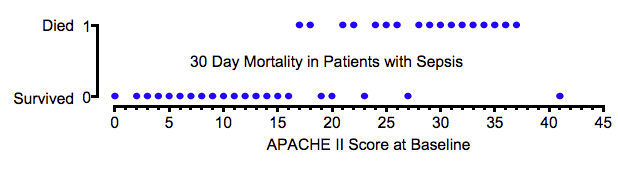
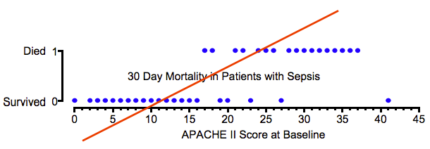
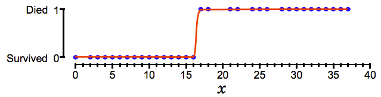
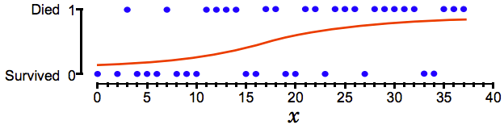

# Logistic regression

## The classification problem

While we're often interested predicting continuous variables based on some input variables (e.g., home price based on number of bedrooms), there are many cases where we want to predict binary outcomes (e.g., it will snow tomorrow). In this case, the input variables may be continuous or not. We will investigate the case where we want to predict some category (e.g., this picture is of a cat, dog, or mouse) at some later point.

A quick note on taxonomy: regression models typically predict continuous values whereas classification models typically predict discrete values (i.e., classes). Logistic regressions are often used as classifiers. A cliffhanger! We will resolve this seeming inconsistency soon.

But we're interested in more than just categorizing input variables into two classes "yes" and "no" (this problem is called binary classification). We'd also like some measure of how likely our response $Y$ of "yes" or "no" is given the input data, $X$. In other words, we'd like the conditional probability distribution of $Y$ on $X$, $\Pr(Y\|X).$

## A statistician's approach

Let's rename our classes 1 ("yes") and 0 ("no"). $Y$ becomes an indicator random variable, which is just a fancy way of saying $Y$ is a random variable associated with whether an event (call it $A$) happens or not. To be completely explicit:

$$
Y = \left\{
\begin{array}{ll}
1 & \textrm{if }A\\
0 & \textrm{otherwise}
\end{array}
\right.
$$

By the definition of expectation, indicator random variables have the property that

$$
\mathbf{E}[Y] = \Pr(Y = 1)\\
\mathbf{E}[Y | X] = \Pr(Y = 1 | X = x)
$$

We could just use a linear regression on the input data to predict $Y$, but this ignores the fact that we'd like to model probabilities and probabilities must stay between 0 and 1! How might we model $p = \Pr(Y = 1)$? One simple thing to do is to take each datapoint $x_i$ and the corresponding output $y_i$ and maximize the probability of all the $y_i$ occurring, given the corresponding $x_i$.

$$
\prod_{i=1}^n \Pr(Y=y_i | X=x_i) = \prod_{i=1}^n p^{y_i}(1-p)^{1-y_i}
$$

Of course, the right-hand side is maximized when $p = \hat{p} = \sum_{i=1}^n y_i / n$. But hang on, do we really want $p$ to be the same regardless of $x_i$? Surely it's more likely to rain when there are storm clouds gathering than during a cloudless, sunny day. Here is a revised likelihood function:

$$
\prod_{i=1}^n \Pr(Y=y_i | X=x_i) = \prod_{i=1}^n p_i^{y_i}(1-p_i)^{1-y_i}
$$

Getting warmer, though a closer look tells us that this function doesn't tell us anything. We can maximize it by setting $\hat{p}_i = y_i$. Once again, we ignore $x_i$. We need some constraints on $p_i$ that force it to depend on $x_i$ and establish some consistency across the $x_i$ we see: $p_i = p(x_i;\theta)$, where we assume some function $p$ and try to estimate $\theta$ by maximizing the new likelihood function:

$$
\prod_{i=1}^n \Pr(Y=y_i | X=x_i) = \prod_{i=1}^n p(x_i;\theta)^{y_i}(1-p(x_i;\theta))^{1-y_i}
$$

## Logistic regression
It so happens that the machinery people have developed for linear regressions are so handy that we ask ourselves how we might use linear regressions to estimate the unknown parameters in our probability function.

1. The simplest approach is to let $p(x)$ be a linear function of $x$ (with $\theta$ as the corresponding coefficients). The problem, though, is linear functions are unbounded, whereas probabilities are bounded between 0 and 1. It's also worth noting that in many problems, we need a much bigger change in $x$ to change $p$ when $p$ is already very close to 1 or 0.

2. After some futzing, we see that

$$
\log \frac{p}{1 - p} = \beta_0 + x\cdot \beta
$$

gives us the two properties that we want: $p$ bounded between 1 and 0 regardless of $x$, and $p$ changes little with respect to $x$ as $p$ gets close to 0 or 1. In the plot below, we let

$$
u=\beta_0 + x\cdot\beta
$$

for simplicity.

This curve is known as the sigmoid curve.

## Linear vs. logistic regression
To illustrate why we may want a logistic regression, we borrow an example from the Vanderbilt slides linked below.

The following figure shows 30 day mortality in a sample of septic
patients as a function of their baseline APACHE II Score.
Patients are coded as 1 or 0 depending on whether they are dead
or alive in 30 days, respectively.

If we wanted to somehow separate the two cases (based on the APACHE II score i.e., we cannot draw a horizontal line at $died = 0.5$), we can see that a line isn't going to work very well! Recall that we want to model the *probability* that a patient will die (that's the vertical axis). To find this probabiltiy we would take the patient's APACHE II score and find the corresponding value on the red line. The linear regression cleary extends well above 1 and below 0; a no-no for probabilities.

Now suppose we model the log odds of the probability ($p / (1-p)$) with a linear regression. We can see that all probabilities along the red curve lie between 0 and 1. The model predicts that all APACHE II scores to the right of the inflection point indicate death and those to the left indicate survival.

## Playing with the sigmoid

In the graph below, we vary the coefficient $\beta$ of $x$ in

$$
\log \frac{p}{1 - p} = \beta_0 + x\cdot \beta
$$

As $\beta$ gets larger, the curve gets steeper.

Varying $\beta_0$ moves the sigmoid to the left ($\beta_0 < 0$) or right ($\beta_0 > 0$).

Regressing the log odds of the probability on some linear function of the inputs helps find the best shape for the data whether a sharp cutoff:

or a much less certain signal:

## The decision boundary

## Computing an example by hand

## Likelihood function for logistic regression

$$
L(\beta_0, \beta) = \prod_{i=1}^np(x_i)^{y_i}(1-p(x_i))^{1-y_i}
$$

Typically maximize log-likelihood because dealing with sums are easier and because multiplying a number of probabilities together exposes us to numerical error (they get too small!):

$$
\log L(\beta_0, \beta) = \sum_{i=1}^n y_i \log p(x_i) + (1-y_i)\log (1-p(x_i))
$$

Note that this looks a lot like cross-entropy:
- [http://math.stackexchange.com/questions/1074276/how-is-logistic-loss-and-cross-entropy-related](http://math.stackexchange.com/questions/1074276/how-is-logistic-loss-and-cross-entropy-related)
- [http://stats.stackexchange.com/questions/198038/cross-entropy-or-log-likelihood-in-output-layer](http://stats.stackexchange.com/questions/198038/cross-entropy-or-log-likelihood-in-output-layer)

## Maximizing the likelihood function
See equations 12.7 to 12.12 in the CMU notes below.

## Logistic regression with more than two classes (multinomial regression)

$$
\Pr (Y = c | X = x) = \frac{e^{\beta_0^{(c)} + x\cdot \beta^{(c)}}}{\sum_ie^{\beta_0^{(i)} + x\cdot \beta^{(i)}}}
$$

## Further topics
- Newton's method in one or more dimensions
- Iteratively re-weighted least squares
- Generalized linear models

## FAQ
- Why is the logistic regression called a regression if it's used to classify binary outcomes?
  - Notice that we are actually 'regressing' the log odds of the probability that our outcome $Y$ is 1 against a linear combination of the explanatory variables.
  - The 'classification' part comes when we apply a threshold (e.g., $Y=1$ for $p\geq0.5$ and $Y=0$ for $y<0.5\ $).
  - More details [here](https://www.quora.com/Why-is-logistic-regression-called-regression-if-it-doesnt-model-continuous-outcomes)
- **TODO** Odds ratio vs. relative ratio
- **TODO** Why do we use odds ratio for logistic regression [here](http://stats.stackexchange.com/questions/215349/why-use-odds-and-not-probability-in-logistic-regression)

## References
- [Vanderbilt medical perspective](http://www.mc.vanderbilt.edu/gcrc/workshop_files/2004-11-12.pdf)
- [CMU statistics perspective](https://www.stat.cmu.edu/~cshalizi/uADA/12/lectures/ch12.pdf)
- [Princeton Woodrow Wilson School of Public Policy](http://data.princeton.edu/wws509/notes/c3.pdf)
