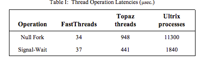

# Scheduler Activations: Effective Kernel Support for the User-Level Management of Parallelism
[link](http://flint.cs.yale.edu/cs422/doc/sched-act.pdf)

**Problem**: user-level threads have a lot of flexibility and often (inherently) better performance, but may not be portable or even correct under some simple assumptions (not inherent, but consequence of inadequate kernel support). Kernel-level threads threads, on the otherhand, are safer, but can be much slower.

**Goals**:
1. when threads don't need kernel intervention, have good performance.
2. When kernel, must be involved, be as efficient as kernel-thread systems
3. Simplify user-level part for easy customization

**Approach**
- Provide each application with *virtual multiprocessor*
- Use *scheduler activations* to enable communication between kernel events and user-level threads.

## 2. The case for user-level thread management
- Inherent cost to access thread management operations (e.g., safety) even when switching between threads in the same address space
- Cost of general kernel-level thread managemenet (e.g., scheduling)
- Simultaneously improve flexibility and performance

### However, there is (or was) poor integration in user-level threads.
- Kernel threads block, resume, pre-empt without notification to user level
- Kernel threads are scheduled obliviously with respect to the user-level thread state

Different solutions fail:
- Have same number of kernel threads as processors can lead to an entire process address space being blocked
- Have more kernely threads than processors, more runnable kernel threads than processors
- Time-slicing causes all kinds of problems for user-level thread systems

## 3. Effective kernely support for the user-level management of parallelism
