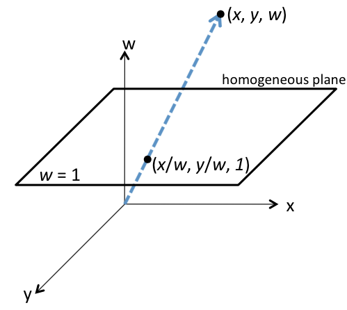

### Homogenous coordinates
Homogenous, or projective coordinates form a coordinate system where we can represent points at infinity using finite coordinates. Homogenous coordinates also let us easily represent affine and, in general, projective transformations by matrices.

To get the homogenous coordinate of some coordinate in $\mathbb{R}^n$, we append the number 1 to create a vector of length $n+1$. In the case of a coordinate in $\mathbb{R}^2$, we represent the coordinate $(x,y)$ as:

$$
(x,y)\Rightarrow\left[
\begin{array}{c}
x\\
y\\
1\\
\end{array}
\right]
$$

We add a further stipulation that any non-zero scalar multiple of a homogenous coordinate is considered the same point. We can think of the homogenous coordinate for some $\mathbb{R}^2$ coordinate and all its non-zero scalar multiples as a line in $\mathbb{R}^3$.

Converting back from some homogenous coordinate:

$$\left[
\begin{array}{c}
x\\
y\\
w\\
\end{array}
\right] \Rightarrow (x/w,y/w)
$$

Continuing with our example in $\mathbb{R}^2$, let us consider the plane $z=1$, or all the points of the form $(x,y,1)$. Every point in $\mathbb{R^2}$ corresponds uniquely with a point $(x,y,z)$ on the plane $z=1$. However, if we want to consider all lines in $\mathbb{R}^3$ that pass through the origin, we must examine points of the form $(x,y,0)$. Intuitively, we call these 'points at infinity' because they never intersect the plan $z=1$. In this way, we represent infinities with finite coordinates.

Using homogenous coordinates, we can now use the power of linear algebra in a higher dimension (e.g., $\mathbb{R}^2$ to $\mathbb{R}^3$) to compute things we could not with normal coordinates.

$$
\left[
\begin{array}{c}
x'\\
y'\\
\end{array}
\right]

=

\left[
\begin{array}{cc}
? & ?\\
? & ?\\
\end{array}
\right]

\left[
\begin{array}{c}
x\\
y\\
\end{array}
\right]

=

\left[
\begin{array}{c}
x + t_x\\
y + t_y\\
\end{array}
\right]
$$

can now be computed via

$$
\left[
\begin{array}{c}
x'\\
y'\\
1\\
\end{array}
\right]

=

\left[
\begin{array}{ccc}
1 & 0 & t_x\\
0 & 1 & t_y\\
0 & 0 & 1\\
\end{array}
\right]

\left[
\begin{array}{c}
x\\
y\\
1\\
\end{array}
\right]

=

\left[
\begin{array}{c}
x + t_x\\
y + t_y\\
1\\
\end{array}
\right]
$$

Translations are an example of an _affine transformation_.

#### References
- [A short introduction to homogenous coordinates](http://ais.informatik.uni-freiburg.de/teaching/ws13/mapping/pdf/slam02-homegenous.pdf)
- [Homogenous coordinates](http://www.cs.mtu.edu/~shene/COURSES/cs3621/NOTES/geometry/homo-coor.html)
