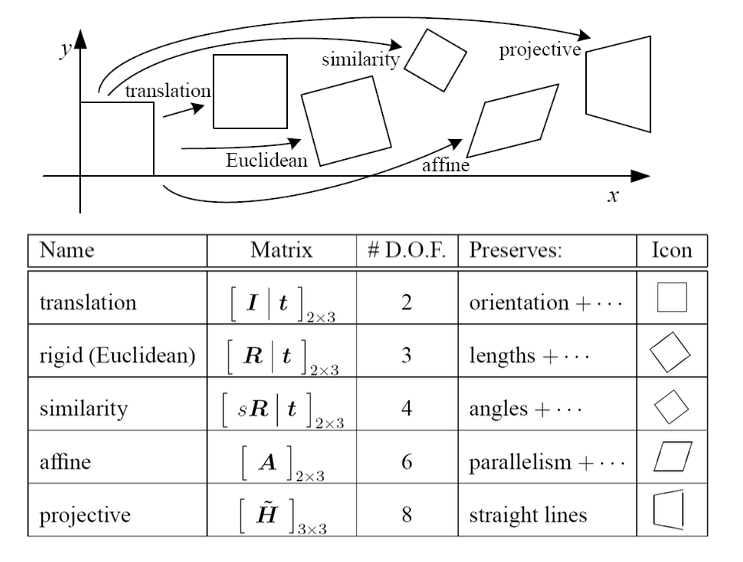

### 2D and 3D Transformations

#### 2D Linear transformations
- Closed under combinations of scale, rotation, sheer, mirror (interestingly, not translation)
- Linear transformations preserve
  - Origin
  - Lines
  - Parallelism
  - Ratios

#### Affine transformations
Affine transformations are a superset of linear transformations; they relax the requirement that the origin is preserved. Affine transformations, like linear transformations, are still closed under composition and preserve

- Lines
- Parallelism
- Ratios

We can tell if a matrix represents an affine transformation if its last row contains all zeros except for a 1 in the last column. Physically, we interpret affine transformations as some combination of a linear transformation and a translation.

#### Projective transformations
Projective transformations are a superset of affine transformations. Parallel lines do not necessarily remain parallel and ratios are not preserved. We can tell if a matrix represents a projective transformation if its last row is not $[0,0,\ldots,1]$ as is required for an affine transformation.

#### Summary of transformations
From [Szeliski's book](http://szeliski.org/Book/drafts/SzeliskiBook_20100903_draft.pdf).

