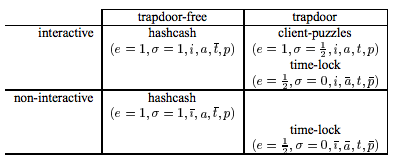

## Hashcash - A Denial of Service Counter-Measure
Adam Back ([original](hashcash.pdf))

### Abstract
_Hashcash_ was originally proposed as a mechanism to throttle systematic abuse of un-metered internet resources such as email, and anonymous remailers in May 1997. Five years on, this paper captures in one place the various applications, improvements suggested and related subsequent publications, and describes initial experience from experiments using hashcash.

The _hashcash_ CPU cost-function computes a token which can be used as a proof-of-work. Interactive and noninteractive variants of cost-functions can be constructed which can be used in situations where the server can issue a challenge (connection oriented interactive protocol), and where it can not (where the communication is store–and–forward, or packet oriented) respectively.

### 1. Introduction
Hashcash [1] was originally proposed as a mechanism to throttle systematic abuse of un-metered internet resources such as email, and anonymous remailers in May 1997. Five years on, this paper captures in one place the various applications, improvements suggested and related subsequent publications, and describes initial experience from experiments using hashcash.

The _hashcash_ CPU cost-function computes a token which can be used as a proof-of-work. Interactive and noninteractive variants of cost-functions can be constructed which can be used in situations where the server can issue a challenge (connection oriented interactive protocol), and where it can not (where the communication is store–and–forward, or packet oriented) respectively.

At the time of publication of [1] the author was not aware of the prior work by Dwork and Naor in [2] who proposed a CPU pricing function for the application of combatting junk email. Subsequently applications for cost functions have been further discussed by Juels and Brainard in [3]. Jakobsson and Juels propose a dual purpose for the work spent in a cost-function: to in addition perform an otherwise useful computation in [4].

### 2. Cost-Functions
A _cost-function_ should be efficiently verifiable, but parameterisably expensive to compute. We use the following notation to define a cost-function.

In the context of cost-functions we use _client_ to refer to the user who must compute a _token_ (denoted $$\mathcal{T}$$) using a cost-function $$\textrm{MINT}()$$ which is used to create tokens to participate in a protocol with a server. We use the term mint for the cost-function because of the analogy between creating cost tokens and minting physical money.

The server will check the value of the token using an evaluation function $$\textrm{VALUE}()$$, and only proceed with the protocol if the token has the required value.

The functions are parameterised by the amount of work $$w$$ that the user will have to expend on average to mint a token.

With _interactive cost-functions_, the server issues a challenge $$\mathcal{C}$$ to the client---the server uses the $$\textrm{CHAL}()$$ function to compute the challenge. (The challenge function is also parameterised by the work factor.)

$$\begin{cases}
  \mathcal{C} & \leftarrow & \textrm{CHAL}(s,w) & \textrm{server challenge function} \\
  \mathcal{T} & \leftarrow & \textrm{MINT}(\mathcal{C}) & \textrm{mint token based on challenge} \\
  \mathcal{V} & \leftarrow & \textrm{VALUE}(\mathcal{T}) & \textrm{token evaluation function} \\
\end{cases}$$

With _non-interactive cost-functions_ the client chooses its own challenge or random start value in the $$\textrm{MINT}()$$ function, and there is no $$\textrm{CHAL}()$$ function.

$$\begin{cases}
  \mathcal{T} & \leftarrow & \textrm{MINT}(s,w) & \textrm{mint token} \\
  \mathcal{V} & \leftarrow & \textrm{VALUE}(\mathcal{T}) & \textrm{token evaluation function} \\
\end{cases}$$

#### 2.1 Publicly Auditable, Probalistic Cost
- A _**publicly auditable**_ cost-function can be _efficiently_ verified by any third party without access to any trapdoor or secret information. (When we say _publicly auditable_ we mean implicitly that the cost-function is _efficiently_ publicly auditable compared to the cost of minting the token, rather than auditable in the weaker sense that the auditor could repeat the work done by the client.)
- A _**fixed cost**_ cost-function takes a fixed amount of resources to compute. The fastest algorithm to mint a fixed cost token is a deterministic algorithm.
- A _**probabilistic cost**_ cost-function is one where the cost to the client of minting a token has a predictable expected time, but a random actual time as the client can most efficiently compute the cost-function by starting at a random start value. Sometimes the client will get lucky and start close to the solution.
  
  There are two types of probabilistic cost _bounded probabilistic cost_ and _unbounded probabilistic cost_.

  - An _**unbounded probabilistic cost**_ cost-function, can in theory take forever to compute, though the probability of taking significantly logner than expected decreases rapidly towards zero. (An example would be the cost-function of being required to throw a head with a fair coin; in theory the user could be unlucky and end up throwing many tails, but in practice the probability of not throwing a head for $$k$$ throws tends towards $$0$$ rapidly as $$\lim_{k\rightarrow infty} \left(\frac{1}{2}\right)^k = 0$$.)
  - With a _**bounded probabilistic cost**_ cost-function there is a limit to how unlucky the client can be in its search for the solution; for example where the client is expected to search some key space for a known solution; the size of the key space imposes an upper bound on the cost of finding the solution.

#### 2.2 Trapdoor-free
A disadvantage of known solution cost-functions is that the challenger can cheaply create tokens of arbitrary value. This precludes public audit where the server may have a conflict of interests, for example in web hit metering, where the server may have an interest to inflate the number of hits on its page where it is being paid per hit by an advertiser.

- A _**trapdoor-free**_ cost-function is one where the server has no advantage in minting tokens.

An example of a trapdoor-free cost-function is the Hashcash [1] cost-function. Juels and Brainard's client-puzzle cost-function is an example of a _known-solution_ cost-function where the server has an advantage in minting tokens. Client-puzzles as specified in the paper are in addition not publicly auditable, though this is due to a storage optimization and not inherent to their design.

### The Hashcash cost-function

Hashcash is a non-interactive, publicly auditable, trapdoor-free cost function with unbounded probabilistic cost.

First we introduce some notation: consider the bitstring $$s=\{0,1\}^*$$, we define $$[s]_i$$ to mean the bit at offset $$i$$, where $$[s]_1$$ is the left-most bit, and $$[s]_{\|s\|}$$ is the right-most bit. $$[s]_{i\ldots j}$$ means the bit-wise substring between and including bits $$i$$ and $$j$$, $$[s]_{i\ldots j}=[s]_i \| \ldots \| [s]_j$$. So $$s=[s]_{1\ldots \|s\|}$$.

We define a binary infix comparison operator $$\stackrel{\textrm{left}}{=}_b$$ where $$b$$ is the length of the common left-substring from the two bit-strings.

$$\begin{eqnarray}
   x \stackrel{\textrm{left}}{=}_0 y && [x]_1 \neq [y]_1 \\
   x \stackrel{\textrm{left}}{=}_b y && [x]_i = [y]_i, \forall_{i=1\ldots b}
\end{eqnarray}$$

Hashcash is computed relative to a service-name $$s$$, to prevent tokens minted for one server being used on another (servers only accepted tokens minted using their own service-name). The service-name can be any bit-string which uniquely identifies the service (e.g., host name, email address, etc).

The hashcash function is defined as (note this is an improved simplified variant since initial publication. See note in section 5):

$$\begin{cases}
  \textrm{PUBLIC}: & \textrm{hash function } \mathcal{H}(\cdot) \textrm{ with output size} k \textrm{bits} \\
  \mathcal{T}\leftarrow\textrm{MINT}(s,w) & \textbf{find } x\in_R \{0,1\}^* \textbf{ s.t. } \mathcal{H}(s\|x)\stackrel{\textrm{left}}{=}_w 0^k \\
  & \textbf{return } (s,x) \\
  \mathcal{V}\leftarrow\textrm{VALUE}(\mathcal{T}) & \mathcal{H}(s\|x)\stackrel{\textrm{left}}{=}_v 0^k\\
  & \textbf{return } v
\end{cases}$$

The hashcash cost-function is based on finding partial hash collisions on the all $$0$$ bits $$k$$-bit string $$0^k$$. The fastest algorithm for computing partial collisions is brute force. There is no challenge as the client can safely choose his own random challenge, and so the hashcash cost-function is a _trapdoor-free_ and _non-interactive_ cost-function. In addition the Hashcash cost-function is _publicly auditable_, because anyone can efficiently verify any published tokens. (In practice $$\|x\|$$ should be chosen to be large enough to make the probability that clients reuse a previously used start value negligible; $$\|x\| = 128$$ bits should be enough even for a busy server.)

The server needs to keep a double spending database of spent tokens, to detect and reject attempts to spend the same token again. To prevent the database growing indefinitely, the service string can include the time at which it was minted. This allows the server to discard entries from the spent database after they have expired. Some reasonable expiry period should be chosen to take account of clock inaccuracy, computation time, and transmission delays.

Hashcash was originally proposed as a counter-measure against email spam, and against systematic abuse of anonymous remailers. It is necessary to use _non-interactive cost-functions_ for these scenarios as there is no channel for the server to send a challenge over. However one advantage of _interactive cost-functions_ is that it is possible to prevent pre-computation attacks. For example, if there is a cost associated with sending each email this may be sufficient to limit the scale of email abuse perpetrated by spammers; however for a pure DoS-motivated attack a determined adversary may spend a year pre-computing tokens to all be valid on the same day, and on that day be able to temporarily overload the system.

It would be possible to reduce the scope for such pre-computation attacks by using a slowly changing beacon (unpredictable broadcast authenticated value changing over time) such as say this weeks winning lottery numbers. In this event the current beacon value is included in the start string, limiting pre-computation attacks to being conducted within the time period between beacon value changes.

### 4. Interactive Hashcash
With the interactive form of hashcash, for use in interactive settings such as TCP, TLS, SSH, IPSEC etc connection establishment a challenge is chosen by the server. The aim of interactive hashcash is to defend server resources from premature depletion, and provide graceful degradation of service with fair allocation across users in the face of a DoS attack where one user attempts to deny service to the other users by consuming as many server resources as he can. In the case of security protocols such as TLS, SSH and IPSEC with computationally expensive connection establishment phases involving public key crypto the server resource being defended is the servers available CPU time.

The interactive hashcash cost-function is defined as follows:

$$\begin{cases}
  \textrm{C}\leftarrow\textrm{CHAL}(s,w): & \textbf{choose }c\in_R \{0,1\}^k \\
  & \textbf{return } (s,w,c)\\
  \mathcal{T}\leftarrow\textrm{MINT}(s,w) & \textbf{find }x\in_R \{0,1\}^* \textbf{ s.t. } \mathcal{H}(s\|c\|x)\stackrel{\textrm{left}}{=}_w 0^k \\
  & \textbf{return }(s,x)\\
  \mathcal{V}\leftarrow\textrm{VALUE}(\mathcal{T}) & \mathcal{H}(s\|c\|x)\stackrel{\textrm{left}}{=}_v 0^k\\
  & \textbf{return }v
\end{cases}$$

#### 4.1 Dynamic throttling
With interactive hashcash it becomes possible to dynamically adjust the work factor required for the client based on server CPU load. The approach also admits the possibility that interactive hashcash challenge-response would only be used during periods of high load. This makes it possible to phase-in DoS resistent protocols without breaking backwards compatibility with old client software. Under periods of high load non-hashcash aware clients would be unable to connect, or would be placed in a limited connection poolsubject to older less effective DoS counter-measures such as random connection dropping.

$$$$ 4.2 hashcash-cookies
With connection-slot depletion attacks such as the syn-flood attack, and straight-forward TCP connection-slot depletion the server resource that is being consumed is space available to the TCP stack to store per-connection state.

In this scenario it may be desirable to avoid keeping per connection state, until the client has computed a token with the interactive hashcash cost-function. This defense is similar to the syn-cookie defense to the syn-flood attack, but here we propose to additionally impose a CPU cost on the connecting machine to reserve a TCP connection-slot.

To avoid storing the challenge in the connection state (which itself consumes space) the server may choose to compute a keyed MAC of the information it would otherwise store and sent it to the client as part of the challenge so it can verify the authenticity of the challenge and token when the client returns them. (This general technique---ofsending a record you would otherwise store together with a MAC to the entity the information is about---is referred to as a _symmetric key certificate_.) This approach is analogous to the technique used in syn-cookies, and Juels and Brainard proposed a related approach but at the application protocol level in their client-puzzles paper.

For example with MAC function $$\mathcal{M}$$ keyed by server key $$K$$ the challenge MAC could be computed as:

$$\begin{cases}
  \textrm{PUBLIC}: & \textrm{MAC function }\mathcal{M}(\cdot,\cdot)\\
  \mathcal{C}\leftarrow\textrm{CHAL}(w) & \textbf{choose } c\in_R\{0,1\}^k\\
  & \textbf{compute } m \leftarrow \mathcal{M}(K, t\|s\|p\|w\|c) \\
  & \textbf{return } (t,s,p,w,c,m)
\end{cases}$$

The client must send the MAC $$m$$, and the challenge $$c$$ and challenge parameters $$p$$ with the response token so that the server can verify the challenge and the response. The server should also include in the MAC the connection parameters, at minimum enough to identify the connection-slot and some time measurement or increasing counter t so that old challenge responses can not be collected and re-used after the connection-slots are free. The challenge and MAC would be sent in the TCP SYN-ACK response message, and the client would include the interactive hashcash token (challenge-response) in the TCP ACK message. As with syn-cookies, the server would not need to keep any state per connection prior to receiving the TCP ACK.

For backwards compatibility with syn-cookie aware TCP stacks, a hashcash-cookie aware TCP stack would only turn on hashcash-cookies when it detected that it was subject to a TCP connection-depletion attack. Similar arguments as given by Dan Bernstein in [5] can be used to show that backwards compatibility is retained, namely under syn-flood attacks Bernstein’s arguments show how to provide backwards compatibility with non syn-cookie aware implementations; similarly under connection-depletion attack hashcash-cookies are only turned on at a point where service would anyway otherwise be unavailable to a non-hashcash-cookie aware TCP stack.

As the flood increases in severity the hashcash-cookie algorithm would increase the collision size required to be in the TCP ACK message. The hashcash-cookie aware client can still connect (albeit increasinly slowly) with a more fair chance against the DoS attacker presuming the DoSer has limited CPU resources. The DoS attacker will effectively be pitting his CPU against all the other (hashcash-cookie aware) clients also trying to connect. Without the hashcashcookie defense the DoSer can flood the server with connection establishments and can more easily tie up all it’s slots by completing n connections per idle connection time-out where n is the size of the connection table, or pinging the connections once per idle connection time-out to convince the server they are alive.

Connections will be handed out to users collectively in rough proportion to their CPU resources, and so fairness is CPU resource based (presuming each user is trying to open as many connections as he can) so the result will be biased in favor of clients with fast processors as they can compute more interactive-hashcash challenge-response tokens per second.

### 5. Hashcash improvements
In the initially published hashcash scheme, the target string to find a hash collision on was chosen fairly by using the hash of the service-name (and respectively the service-name and challenge in the interactive setting). A subsequent improvement suggested independently by Hal Finney [6] and Thomas Boschloo [7] for hashcash is to find a collision against a fixed output string. Their observation is that a fixed collision target is also fair, simpler and reduces verification cost by a factor of 2. A fixed target string which is convenient to compare trial collisions against is the $$k$$-bit string $$0^k$$ where $$k$$ is the hash output size.

### 6. Low Variance
Ideally cost-function tokensshould take a predictable amount of computing resourcesto compute. Juels and Brainard’s client-puzzle construction provides a probabilistic bounded-cost by issuing challenges with known-solutions, however while thislimits the theoretical worst case running time, it makeslimited practical difference to the variance and typical experienced running time. The technique of using known solutions is also not applicable to the non-interactive setting. It is an open question as to whether there exist probabilistic bounded-cost, or fixed-cost non-interactive cost-functions with the same order of magnitude of verification cost as hashcash.

The other more significant incremental improvement due to Juels and Brainard is the suggestion to use multiple sub-puzzles with the same expected cost, but lower variance in cost. This technique should be applicable to both the non-interactive and interactive variants of hashcash.

#### 6.1 Non-Parallelizability and Distributed DoS
Roger Dingledine, Michael Freedman and David Molnar put forward the argument that non-parallelizable costfunctions are less vulnerable to Distributed DoS (DDoS) in chapter 16 of [8]. Their argument is that non-parallelizable cost-functions frustrate DDoS because the attacker is then unable sub-divide and farm out the work of computing an individual token.

The author described a fixed-cost cost-function in [9] using Rivest, Shamir and Wagner’s time-lock puzzle [10] which also happens to be non-parallelizable. The time-lock puzzle cost-function can be used in either an interactive or non-interactive setting as it is safe for the user to chose their own challenge. The applicability of Rivest et al’s time-lock puzzle as a cost-function was also subsequently observed by Dingledine et al in [8].

For completeness we present the time-lock puzzle based fixed-cost and non-parallelizable cost-function from [9] here:

$$\begin{cases}
  \textrm{PUBLIC}: & n = pq\\
  \textrm{PRIVATE}: & \textrm{primes } p \textrm{ and } q, \phi(n)=(p-1)(q-1)\\
  \mathcal{C}\leftarrow\textrm{CHAL}(s,w) & \textbf{choose } c\in_R[0,n)\\
  & \textbf{return }(s,c,w)\\
  \mathcal{T}\leftarrow\textrm{MINT}(\mathcal{C}) & \textbf{compute }x\leftarrow\mathcal{H}(s\|c)\\
  & \textbf{compute }y\leftarrow x^{x^w}\mod n \\
  & \textbf{return }(s,c,w,y)\\
  \mathcal{V}\leftarrow\textrm{VALUE}(\mathcal{T}) & \textbf{compute }x\leftarrow\mathcal{H}(s\|c)\\
  & \textbf{compute }z\leftarrow x^w\mod\phi(n)\\
  & \textbf{if } x^z=y\mod n \textbf{ return }w\\
  & \textbf{else return }0
\end{cases}$$

The client does not $$\phi(n)$$, and so the most efficient method for the client to calculate $$\textrm{MINT}()$$ is repeated exponentiation, which requires $$w$$ exponentiations. The challenger knows $$\phi(n)$$ which allows a more efficient computation by reducing the exponent $$\mod\phi(n)$$, so the challenger can execute $$\textrm{VALUE}()$$ with 2 modular exponentiations. The challenger as a side-effect has a trapdoor in computing the cost-function as he can compute $$\textrm{MINT}()$$ efficiently using the same algorithm.

We argue however that the added DDoS protection provided by non-parallelizable cost-functions is marginal: unless the server restricts the number of challenges it hands out to a recognizably unique client the DDoS attacker can farm out multiple challenges as easily as farm out a sub-divided single challenge, and consume resources on the server at the same rate as before. Further it is not that hard for a single client to masquerade as multiple clients to a server.

Consider also: the DDoS attacker has generally due to the nature of his method of commandeering nodes an equal number of network connected nodes at his disposal as processors. He can therefore in any case have each attack node directly participate in the normal protocol indistinguisably from any legitimate user. This attack strategy is also otherwise optimal anyway as the attack nodes will present a varied set of source addresses which will foil attempts at per-connection fairness throttling strategies and router based DDoS counter-measures based on volume of traffic across IP address ranges. Therefore for the natural attack node marshalling patterns non-parallelizable cost-functions offer limited added resistance.

As well as the arguments against the practical efficacy and value of non-parallelizable cost-functions, to date non-parallelizable cost functions have had orders of magnitude slower verification functions than non-parallelizable cost-functions. Thisis because the non-parallelizable cost-functionsso far discussed in the literature are related to trapdoor public key cryptography constructs which are inherently less efficient. It is an open question as to whether there exist non-parallelizable cost-functions based on symmetric-key (or public-key) constructs with verification functions of the same order of magnitude as those of symmetric-crypto based cost-functions.

While for the application of time-lock puzzles to cost-functions, a reduced public key size could be used to speed up the verification function, this approach introduces risk that the modulus will be factored with the result that the attacker gains a big advantage in minting tokens. (Note: factoring is itself a largely parallelizable computation.)

To combat this the server should change the public parameters periodically. However in the particular case of the public parameters used by time-lock puzzles (which are the same as the RSA modulus used in RSA encryption), this operation is itself moderately expensive, so this operation would not be performed too frequently. It would probably not be wise to deploy software based on key sizes below 768 bits for this aplication, in addition it would help to change keys periodically, say every hour or so. (RSA modulii of 512 bits have recently been factored by a closed group as discussed in [11] and more recently have been demonstrated by Nicko van Someren et al to be factorizable using standard equipment in an office as reported in [12]; DDoS attackers are known be able to muster significant resources, probably easily exceeding those used in this demonstration.)

The time-lock puzzle cost-function also is necessarily trap-door as the server needs a private verification-key to allow it to efficiently verify tokens. The existance of a verification-key presents the added risk of key compromise allowing the attacker to by-pass the cost-function protection. (The interactive hashcash cost-function by comparison is trap-door-free, so there is no key which would allow an attacker a short-cut in computing tokens). In fact if the verification-key were compromised, it could be replaced, but this need adds complexity and administrative overhead as this event needs to be detected and manual intervention or some automated detection triggering key-replacement implemented. 

The time-lock puzzle cost-function also will tend to have larger messages as there is a need to communicate planned and emergency re-keyed public parameters. For some applications, for example the syn-cookie and hashcashcookie protocols, space is at a premium due to backwards compatibility and packet size constraints imposed by the network infrastructure.

So in summary we argue that non-parallelizable cost-functions are of questionable practical value in protecting against DDoS attacks, have more expensive verification functions, incur the risk of verification key compromise and attendant key management complexities, have larger messages, and are significantly more complex to implement. We therefore recommend instead the simpler hashcash protocol (or if the public-auditability and non-interactive options are not required Juels and Brainard’s client-puzzles are roughly equivalent).

### 7. Applications
Apart from the initially proposed applications for hashcash of throttling DoS against remailer networks and detering emailspam,since publication the following applications have been discussed, explored and in some casesimplemented and deployed:

- hashcash-cookies, a potential extension of the syn-cookie as discussed in section 4.2 for allowing more graceful service degradation in the face of connection-depletion attacks. 
- interactive-hashcash as discussed in section 4 for DoS throttling and graceful service degradation under CPU overload attacks on security protocols with computationally expensive connection establishment phases. No deployment but the analogous client-puzzle system was implemented with TLS in [13] 
- hashcash throttling of DoS publication floods in anonymous publication systems such as Freenet [14], Publius [15], Tangler [16], 
- hashcash throttling of service requests in the cryptographic Self-certifying File System [17]
- hashcash throttling of USENET flooding via mail2news networks [18] 
- hashcash as a minting mechanism for Wei Dai’s b-money electronic cash proposal, an electronic cash scheme without a banking interface [19]

### 8. Cost-function classification scheme
We list here a classification of characteristics of cost-functions. We use the following notation to denote the properties of a cost-function:

$$\begin{equation}
([e=\{1,\frac{1}{2},0\}],[\sigma=\{1,\frac{1}{2},0\}],[\{i,\bar{i}\}],[\{a,\bar{a}\}],[\{t,\bar{t}\}],[\{p,\bar{p}\}])
\end{equation}$$

Where $$e$$ is the efficiency: value $$e=1$$ means _efficiently-verifiable_---verifiable with cost comparable to or lower than the cost of verifying symmetric key constructs such as hashcash which consume just a single compression round of an iterative compression function based hash function such as SHA1 or MD5. Value $$e=\frac{1}{2}$$ means _practically-verifiable_ we mean less efficiently than _efficiently-verifiable_, but still efficient enough to be practical for some applications, for example the author considers the time-lock puzzle based cost-function with its two modular exponentiations to fall into this category. Value $$e=0$$ means _verifiable but impractical_, that the cost-function is verifiable but the verification function is impractically slow such that the existance of the cost-function serves only as a proof of concept to be improved upon for practical use.

And $$\sigma$$ is a characterization of the standard deviaion, value $$\sigma=0$$ means _fixed-cost_, $$\sigma=\frac{1}{2}$$ means _bounded probabilistic cost_ and $$\sigma=1$$ means _unbounded probabilistic cost_. Note by _bounded probabilistic-cost_ we mean usefully bounded---a bound in the work factor in excess of a work-factor that an otherwise functionally similar unbounded cost-function would only reach with negligible probability would not be useful.

And $$i$$ denotes that the function is _interactive_, and $$\bar{i}$$ that the cost-function is _non-interactive_.

And $$a$$ denotes that that the cost-function is _publicly auditable_, $$\bar{a}$$ denotes that the cost-function is not _publicly auditable_, which means in practice that it is only verifiable by the service using a private key material. Note by _public-auditability_ we mean _efficiently_ publicly-auditable, and would not consider repeating the work of the token minter as adequate efficiency to classify.

And $$t$$ denotes that the server has a _trapdoor_ in computing the cost-function, conversely $$\bar{t}$$ denotes that server has no trapdoor in computing the cost-function.

And $$p$$ denotes that the cost-function is parallelizable, $$\bar{p}$$ denotes that the cost function is _non-parallizeable_.

#### 8.1 Open Problems
- existance of _efficiently-verifiable non-interactive fixed-cost_ cost functions $$(e=1,\sigma=0,\bar{i})$$ (and the related weaker problem: existance of same with _probabilistic bounded-cost_ $$(e=1,\sigma=\frac{1}{2},\bar{i})$$)
- existance of _efficiently-verifiable non-interactive non-parallelizable_ cost-functions $$(e=1,\bar{i},\bar{p})$$ (and the related weaker problem: existance of same in interactive setting $$(e=1,i,\bar{p})$$)
- existance of _publicly-auditable non-interactive fixed-cost_ cost-functions $$(\sigma=0,\bar{i},a)$$ (and the related weaker problem: existance of same with _bounded probabilistic-cost_ $$(\sigma=\frac{1}{2},\bar{i},a)$$)
